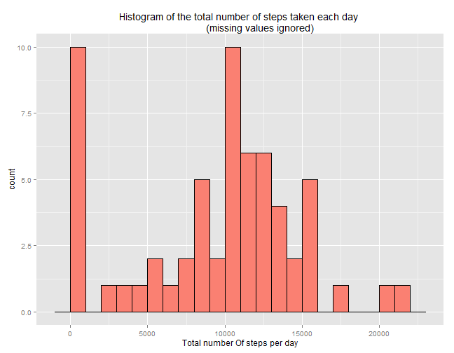
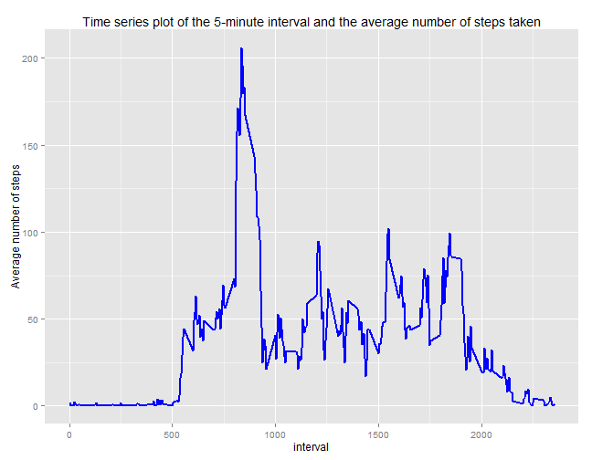
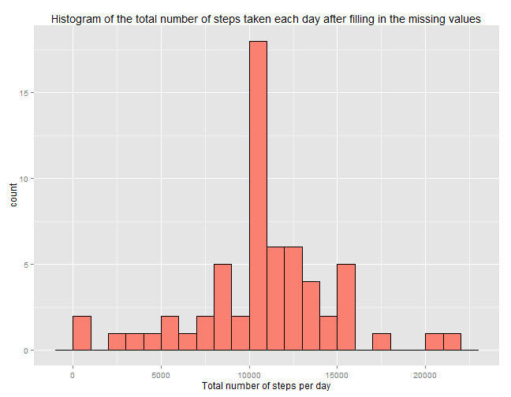

Set your working directory to the directory where the course project repository 
was cloned from Github.

## Loading and preprocessing the data

First we unzip the "activity.zip" file provided in the forked directory.  

We aslo get to know the names of the files in the compressed file, their size and 
the date on which they were made.  


```r
unzip("activity.zip")
unzip("activity.zip", list = T)
```

```
##           Name Length                Date
## 1 activity.csv 350829 2014-02-11 10:08:00
```

Then, we read the activity data set and convert the date variable to class "Date".


```r
activity_data <- read.csv("activity.csv")
unlink("activity.csv") #Removing "activity.csv" after reading in all the required data.
activity_data <- transform(activity_data, date = as.Date(date))
```

## What is mean total number of steps taken per day?

We calculate the total number of steps taken per day disregarding any missing 
values.


```r
suppressMessages(library(dplyr))
steps_perday <- activity_data %>% group_by(date) %>% 
      summarize(tot_steps =  sum(steps,na.rm = TRUE))
```

Then we make a histogram of the total number of steps taken each day using ggplot.
(missing values ignored)


```r
library(ggplot2)
g <- ggplot(steps_perday, aes(x = tot_steps)) + geom_histogram(fill = "salmon", 
                                                               color = "black", 
                                                               binwidth = 1000 )
g <- g + labs(x = "Total number Of steps per day") 
g <- g + labs(title = "Histogram of the total number of steps taken each day 
              (missing values ignored)")
g
```

 

Now we calculate the mean and median of the total number of steps taken per day.
(missing values ignored)


```r
median_steps_perday <- median(steps_perday$tot_steps)
mean_steps_perday <- mean(steps_perday$tot_steps)
```

- The **mean** of total number of steps taken per day is **``9354.2295082``**.
(missing values ignored)

- The **median** of total number of steps taken per day is **``10395``**.
(missing values ignored)

## What is the average daily activity pattern?

We find the average number of steps for each interval averaged across all days.
(missing values ignored)


```r
act_pattern <- activity_data %>% group_by(interval) %>% 
      summarize(steps = mean(steps,na.rm=TRUE))
```

Then we make a time series plot of the 5-minute interval (x-axis) and the average
number of steps taken, averaged across all days (y-axis).  


```r
g1 <- ggplot(act_pattern, aes(x = interval, y = steps)) + 
      geom_line(color = "blue", size = 1 )
g1 <- g1 + labs(y = "Average number of steps")
g1 <- g1 + labs(title = "Time series plot of the 5-minute interval and the average number of steps taken")
g1
```

 

The x-axis scale of this plot is somewhat distorted because the interval labels 
are named as integers with thousands and hundreds places carrying the hour of the
day while the tens and ones places carry the minutes. However, the plot can still 
be used to observe the trends in the average number of steps across different
intervals.

Now we find the 5-minute interval which, on average across all the days in the dataset,
contains the maximum number of steps.


```r
max_step_interval <- act_pattern$interval[which.max(act_pattern$steps)]
max_step_interval_hour <- floor(max_step_interval/100)
max_step_interval_minute <- max_step_interval - max_step_interval_hour*100
```

**The 5-interval which on average, contains maximum number of steps across all the days**
**in the dataset is ``835``.**  

**Which means the 5- minute interval starting at ``8``** 
**hours and ``35`` minutes is the one with maximum** 
**number of steps on an average.**

## Imputing missing values

We calculate the total number of missing values in the dataset.


```r
NA_actdt_index <-  which(is.na(activity_data$steps))
total_missing <- length(NA_actdt_index)
```

**The total number of missing values in the dataset are ``2304``.**

### Strategy for filling missing values.

* The missing values are filled by using the __rounded mean__ for that 5-minute interval.
* We have already found the average number of steps for each interval averaged across
  all days by ignoring the missing values and stored that data in ```act_pattern```.
* The number of steps in a 5-minute as mentioned in the present dataset is a whole
  number. Therefore, **we round off the mean for that 5-minute interval for imputing**
  **missing data.**


```r
act_data_imputed <- activity_data
for(i in NA_actdt_index){
      act_data_imputed[i,1] <- round(act_pattern[act_pattern$interval == activity_data[i,3],2])
}
```

We calculate the total number of steps taken per day after filling in the missing 
values.


```r
st_perday_imp <- act_data_imputed %>% group_by(date) %>% 
      summarize(tot_steps =  sum(steps)) 
```

Then we make a histogram of the total number of steps taken each day after filling
in the missing values using ggplot.


```r
g2 <- ggplot(st_perday_imp, aes(x = tot_steps)) + geom_histogram(fill = "salmon", 
                                                               color = "black", 
                                                               binwidth = 1000 )
g2 <- g2 + labs(x = "Total number of steps per day")
g2 <- g2 + labs(title = "Histogram of the total number of steps taken each day after filling in the missing values")
g2
```

 

Now we calculate the mean and median of the total number of steps taken per day 
after filling in the missing values.


```r
median_st_perday_imp <- median(st_perday_imp$tot_steps)
mean_st_perday_imp <- mean(st_perday_imp$tot_steps)
```

- The **mean** of total number of steps taken per day is **``10765.64``**.
(missing values imputed)

- The **median** of total number of steps taken per day is **``10762``**.
(missing values imputed)

The **mean** and **median** of total number of steps taken per day has increased 
when the missing values are filled in with the rounded mean of the steps in corresponding
interval averaged across all days.

The total daily number of steps for the days which had no missing values had no 
change even after imputing missing data. 

However, the total daily number of steps for the days which had missing values for all intervals is now ``10762``.  

## Are there differences in activity patterns between weekdays and weekends?

We create a new factor variable in the dataset with two levels - "weekday" and "weekend" indicating whether a given date is a weekday or weekend day.


```r
act_weekday_data <- mutate(act_data_imputed, 
                           DayofWeek = factor(weekdays(date)=="Sunday"|
                                              weekdays(date)=="Saturday", 
                                              labels = c("Weekday","Weekend")))
```

We find the average number of steps for each interval averaged across all weekdays
or weekends.


```r
act_pattern_wday <- act_weekday_data %>% group_by(interval, DayofWeek) %>% 
      summarize(steps = mean(steps))
```

Then we make a panel plot containing a time series plot of the 5-minute interval
(x-axis) and the average number of steps taken, averaged across all weekday days
or weekend days (y-axis).


```r
g3 <- ggplot(act_pattern_wday, aes(x = interval, y = steps)) + 
      geom_line(color = "blue", size = 1 ) + facet_grid(DayofWeek~.)
g3 <- g3 + labs(y = "Average number of steps")
g3
```

 

The x-axis scale of this plot is somewhat distorted because the interval labels 
are named as integers with thousands and hundreds places carrying the hour of the
day while the tens and ones places carry the minutes. However, the plot can still 
be used to observe the trends in the average number of steps across different
intervals.
